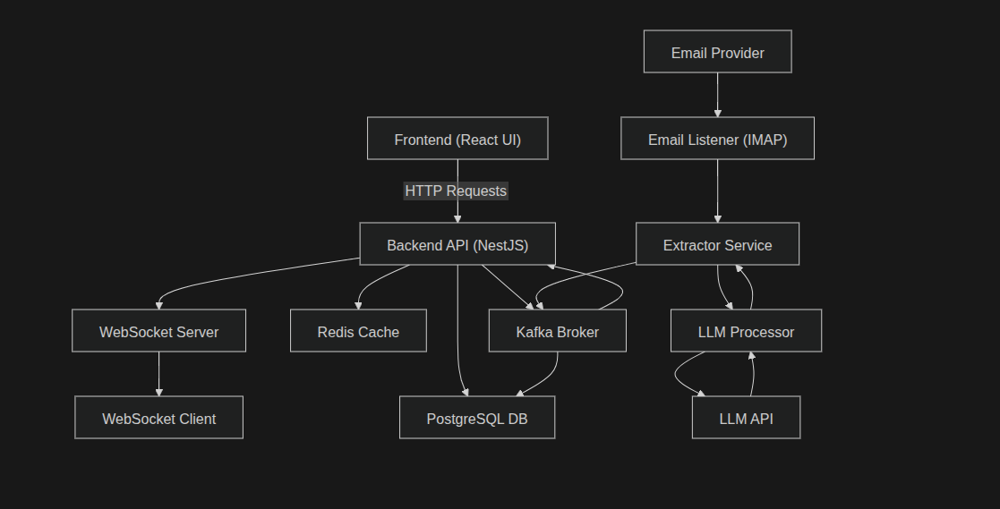

# Real Estate Intelligence Platform

## Overview

A comprehensive, event-driven platform that actively monitors email accounts (via standard IMAP), uses LLMs to identify real estate emails and extract property links, scrapes the property pages, structures the information via robust regex parsing, and presents the data in a web dashboard with advanced reporting capabilities.

The project has evolved from a single-script pipeline into a robust microservices architecture.

## Architecture



The system utilizes an event-driven microservices architecture orchestrated with **Docker Compose**:

- **Frontend (`/frontend`)**: React + TypeScript + Vite web application for viewing collected property listings, adding email accounts, and viewing/downloading daily reports.
- **Backend API (`/apps/api`)**: NestJS application managing database operations, user authentication, and serving data to the frontend.
- **Logger Service (`/apps/logger`)**: NestJS microservice handling centralized logging.
- **Python Worker (`/python`)**: A background service that:
  - Constantly monitors registered email inboxes (using `elsai-cloud` integration).
  - Uses `elsai-model` (LLM) to intelligently classify real estate emails and extract property listing URLs.
- **Infrastructure**:
  - **Kafka**: Message broker orchestrating events between services (`property.links`, `scrape.results`, `app.logs`, `email.check.trigger`).
  - **PostgreSQL**: Relational database storing email credentials, property records, and system configurations.
  - **Redis**: Caching and managing background job queues.

## Tech Stack

| Component | Technologies |
| --- | --- |
| **Frontend** | React, TypeScript, Vite |
| **Backend** | Node.js, NestJS, TypeORM |
| **Python Worker** | Python 3, `elsai-model`, `aiokafka`, `sqlalchemy`, `httpx` |
| **Databases/Broker**| PostgreSQL, Redis, Apache Kafka |
| **Deployment** | Docker, Docker Compose |

## Environment Setup and Running

### Prerequisites
- Docker & Docker Compose installed on your system.
- Node.js & npm (optional, for local frontend/backend dev instead of Docker).
- Python 3.x (optional, for local worker dev).

### Running with Docker Compose

1. Copy `.env.example` to `.env` in the root directory and populate it with your specific API keys, database credentials, and any required LLM configuration headers.
2. Start the platform using Docker Compose:
   ```bash
   docker-compose up -d --build
   ```
3. The platform will initialize the database, create the necessary Kafka topics via an initializer container, and start all application services.

### Adding and Managing Email Accounts (No more JSON configs)
Unlike older versions of this tool, **we no longer use `email_accounts.json` or local JSON files**.
To add an email account for monitoring:
1. Open the **Frontend App** at `http://localhost:8080`.
2. Navigate to the Email Manager page.
3. Add your email accounts dynamically (for example, using Gmail App Passwords). Credentials are securely stored in the PostgreSQL database and immediately picked up by the backend workers.

### Network Ports Layout
When running via `docker-compose`, the following ports are mapped to your host:
- **Frontend App**: `http://localhost:8080`
- **Main REST API**: `http://localhost:3000`
- **Logger API**: `http://localhost:3001`
- **PostgreSQL**: `5433`
- **Redis**: `16379`
- **Kafka**: `19092`

## Key Features

- **Email Monitoring**: Actively tracks and processes unread (and targetted sent) emails for Gmail accounts dynamically loaded from the PostgreSQL database—all manageable via the UI.
- **AI-Assisted Email Filtering & URL Extraction**: Parses incoming emails using `elsai-model` to reliably identify real-estate content and extract valid property URLs.
- **Automated Property Scraping & Regex Extraction**: Gracefully handles real estate platforms (e.g., 99acres, SquareYards, Housing.com) to extract raw page text, which is then parsed using regular expressions on the NestJS backend to retrieve clean datasets containing BHK, bathrooms, and exact pricing.
- **Dashboard & Reporting**: User interface capabilities to observe scraping results globally or per user, and generate or download structured daily status reports.

## Project Structure

```text
.
├── apps/
│   ├── api/             # NestJS Primary Backend
│   └── logger/          # NestJS Logging Microservice
├── frontend/            # React/Vite web application
├── libs/                # Shared internal libraries/modules
├── python/              # Python application logic (Email Monitor, Extractor, LLM)
├── scripts/             # Infrastructure scripts (e.g. init.sql for Postgres)
├── docker-compose.yml   # Full system orchestration
└── package.json         # Root package manager configuration
```
