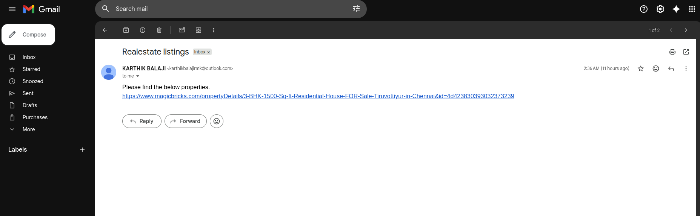
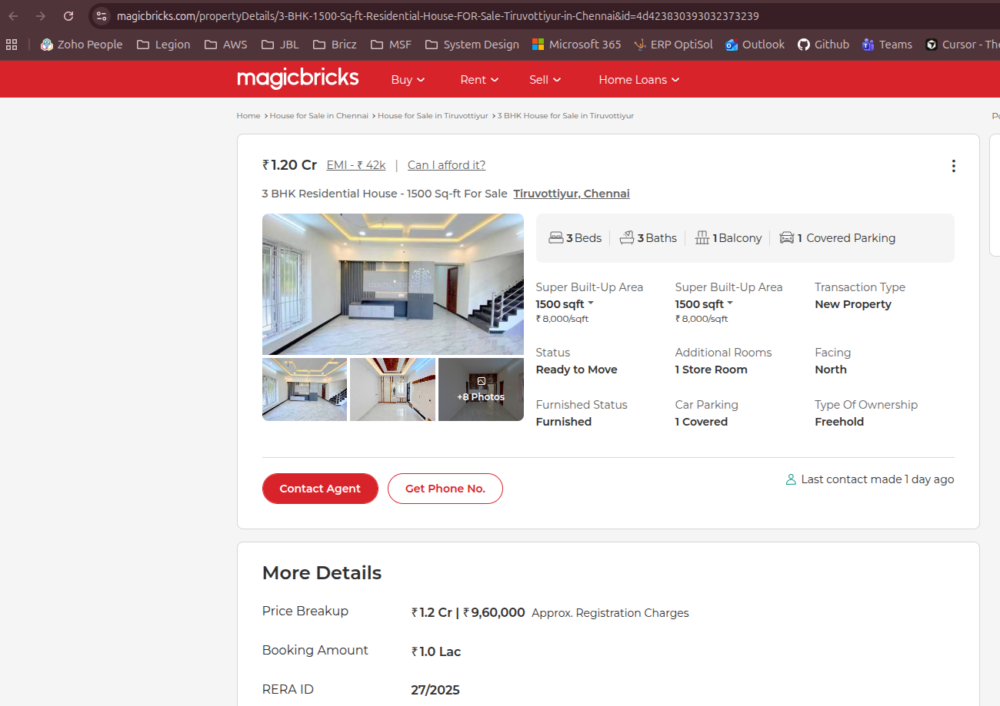
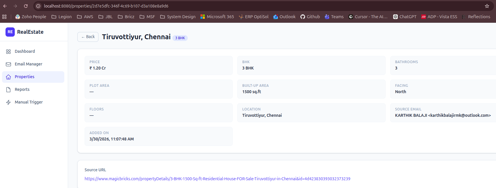

# Validation Evidence — Real Estate Intelligence Platform

## Overview

This document demonstrates an end-to-end validation of the Real Estate Intelligence Platform, proving the agent's ability to autonomously **monitor emails → identify property URLs → scrape listing data → structure and present results** in the dashboard — all without manual intervention.

The following walkthrough traces a single property listing from email receipt to fully extracted, structured data in the application.

---

## Step 1: Email Monitoring — Incoming Real Estate Email

> The agent continuously monitors registered Gmail inboxes via IMAP for new real estate related emails.



**What's happening:**
- The monitored Gmail inbox receives an email with the subject **"Realestate listings"**.
- The sender (`karthikbalajirmk@outlook.com`) shares a property URL in the email body.
- The email contains a direct link to a **MagicBricks** property listing:
  ```
  https://www.magicbricks.com/propertyDetails/3-BHK-1500-Sq-ft-Residential-House-FOR-Sale-Tiruvottiyur-in-Chennai&id=4d4238303930323373239
  ```

**Agent actions at this stage:**
1. The Python worker's IMAP listener detects the new unread email.
2. The email content is sent to the **elsai-model (LLM)** for classification.
3. The LLM confirms this is a real estate email and extracts the property URL.
4. The extracted URL is published to the **`property.links`** Kafka topic for scraping.

---

## Step 2: Property Source Page — Live Listing on MagicBricks

> The URL extracted by the agent points to an actual property listing on MagicBricks.com.



**Source property details (as listed on MagicBricks):**

| Field                | Value                                |
| -------------------- | ------------------------------------ |
| **Price**            | ₹ 1.20 Cr                           |
| **Type**             | 3 BHK Residential House              |
| **Location**         | Tiruvottiyur, Chennai                |
| **Super Built-Up Area** | 1,500 sq.ft                       |
| **Bedrooms**         | 3 Beds                               |
| **Bathrooms**        | 3 Baths                              |
| **Balcony**          | 1                                    |
| **Car Parking**      | 1 Covered                            |
| **Furnished Status** | Furnished                            |
| **Facing**           | North                                |
| **Transaction Type** | New Property                         |
| **Status**           | Ready to Move                        |
| **RERA ID**          | 27/2025                              |

**Agent actions at this stage:**
1. The NestJS backend's **Scraper Processor** consumes the URL from the `property.links` Kafka topic.
2. A **Playwright** browser instance navigates to the MagicBricks page.
3. The full page text content is scraped and extracted.
4. **Regex-based parsing** is applied to the raw text to extract structured property fields (BHK, price, location, area, bathrooms, etc.).
5. The structured result is persisted to the **PostgreSQL** database.

---

## Step 3: Extracted Result — Agent Dashboard Output

> The agent's dashboard displays the fully structured, extracted property data — matching the source listing.



**Extracted data by the agent:**

| Field              | Extracted Value                                              |
| ------------------ | ------------------------------------------------------------ |
| **Price**          | ₹ 1.20 Cr                                                   |
| **BHK**            | 3 BHK                                                        |
| **Bathrooms**      | 3                                                             |
| **Built-Up Area**  | 1500 sq.ft                                                    |
| **Facing**         | North                                                         |
| **Location**       | Tiruvottiyur, Chennai                                         |
| **Source Email**    | KARTHIK BALAJI \<karthikbalajirmk@outlook.com\>               |
| **Added On**       | 3/30/2026, 11:07:48 AM                                        |
| **Source URL**      | [MagicBricks Listing](https://www.magicbricks.com/propertyDetails/3-BHK-1500-Sq-ft-Residential-House-FOR-Sale-Tiruvottiyur-in-Chennai&id=4d4238303930323373239) |

**Validation result:**
All critical fields were accurately extracted and match the original MagicBricks listing — **Price**, **BHK**, **Bathrooms**, **Built-Up Area**, **Facing**, and **Location** are all correctly captured.

---

## End-to-End Data Flow Summary

```
┌─────────────────────┐
│   Gmail Inbox       │  ← Email with property URL received
│   (IMAP Monitored)  │
└────────┬────────────┘
         │
         ▼
┌─────────────────────┐
│   Python Worker     │  ← LLM classifies email as real estate
│   (elsai-model)     │  ← Extracts MagicBricks URL
└────────┬────────────┘
         │  Kafka: property.links
         ▼
┌─────────────────────┐
│   NestJS Backend    │  ← Playwright scrapes the page
│   (Scraper)         │  ← Regex extracts structured fields
└────────┬────────────┘
         │  PostgreSQL
         ▼
┌─────────────────────┐
│   React Dashboard   │  ← Displays structured property data
│   (Frontend)        │
└─────────────────────┘
```

## Conclusion

This end-to-end validation confirms the Real Estate Intelligence Platform successfully:

- ✅ **Monitors** email inboxes in real-time via IMAP
- ✅ **Classifies** incoming emails using LLM intelligence
- ✅ **Extracts** property URLs from email content
- ✅ **Scrapes** live property listing pages using Playwright
- ✅ **Structures** raw page data into clean, usable fields via regex parsing
- ✅ **Presents** the extracted data in a user-friendly dashboard with full traceability back to the source email and URL
